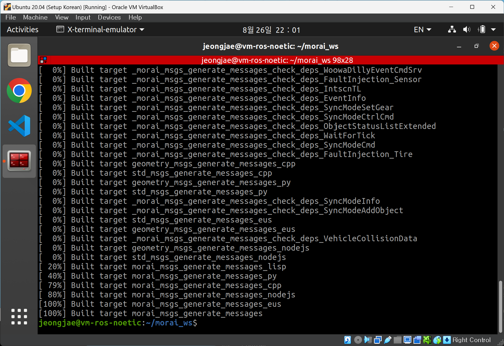
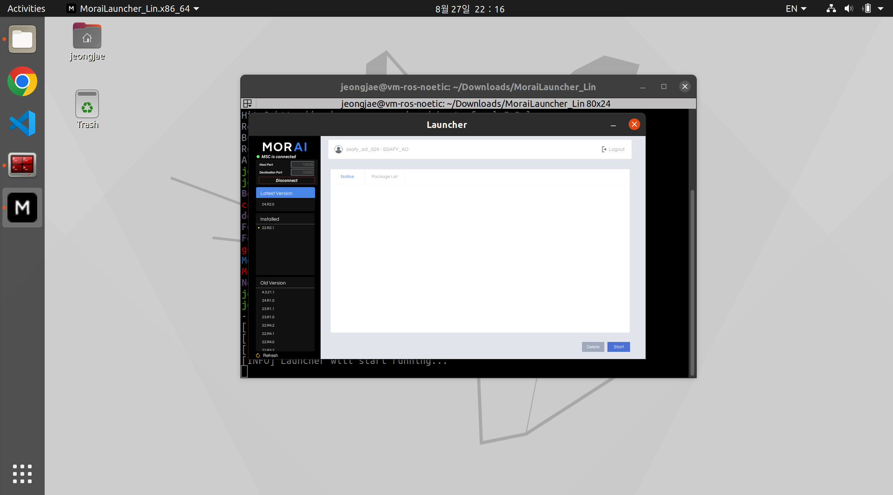
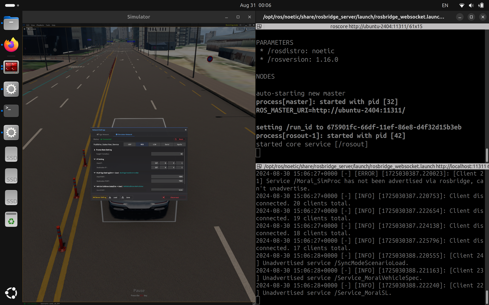
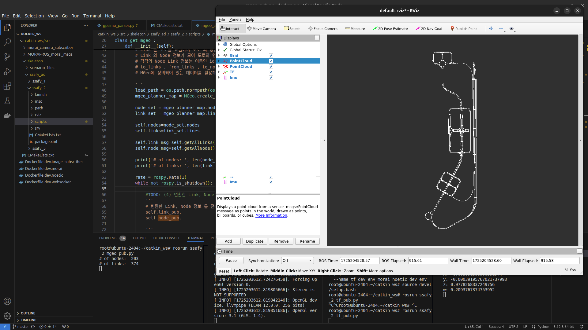
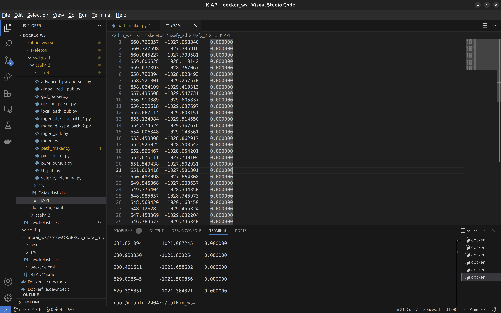
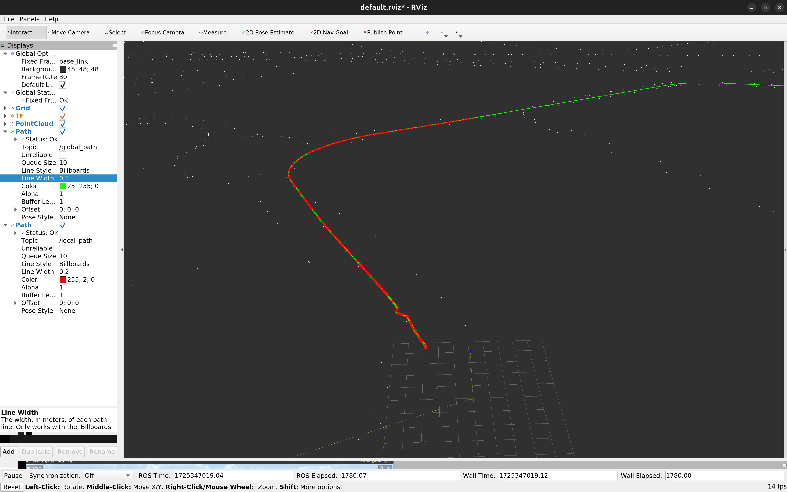
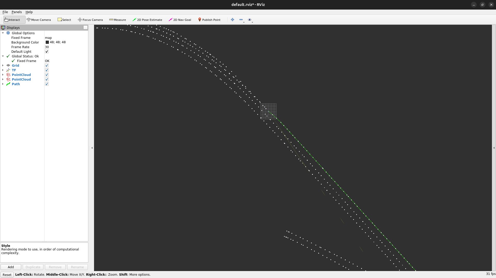
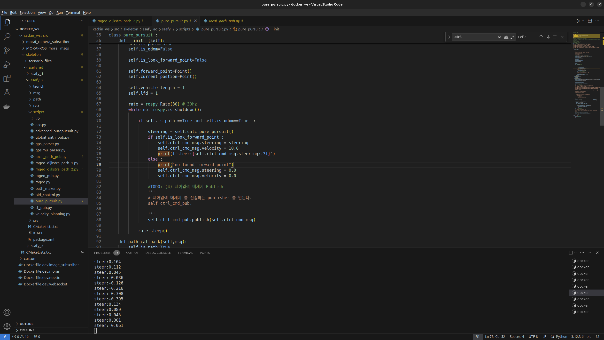

# 이정재

## TIL

### Week 1

#### Day 1
1. Create VBox Instance(ROS Noetic in Ubuntu 20.04)

2. Fail to install ROS2 Foxy in Ubuntu 20.04

3. Complete to build `morai_msgs`

4. Fail to connect the Morai Simulator

#### Day 2
1. Connect to Android App

2. Fail to install Morai Sim. in VBox

3. VirtualBox video memory maximum settings

[VirtualBox Video Memory Limit](https://forums.virtualbox.org/viewtopic.php?t=107806)

#### Day 3
1. Multi Ego 기능 확인

2. 서브 프로젝트 1 2-2까지 진행 완료

#### Day 4
1. 서브 프로젝트 1 완료

2. Ubuntu 20.04 Triple Boot - Fail

#### Day 5
1. Ubuntu 24.04 Triple Boot

2. Morai Sim & Docker Container 연동 완료

### Week 2

#### Day 0
1. Docker Image 파일 생성

2. 서브 프로젝트 2 2-1까지 진행 완료

#### Day 1, 2
1. 서브 프로젝트 2 4-2까지 진행 완료

