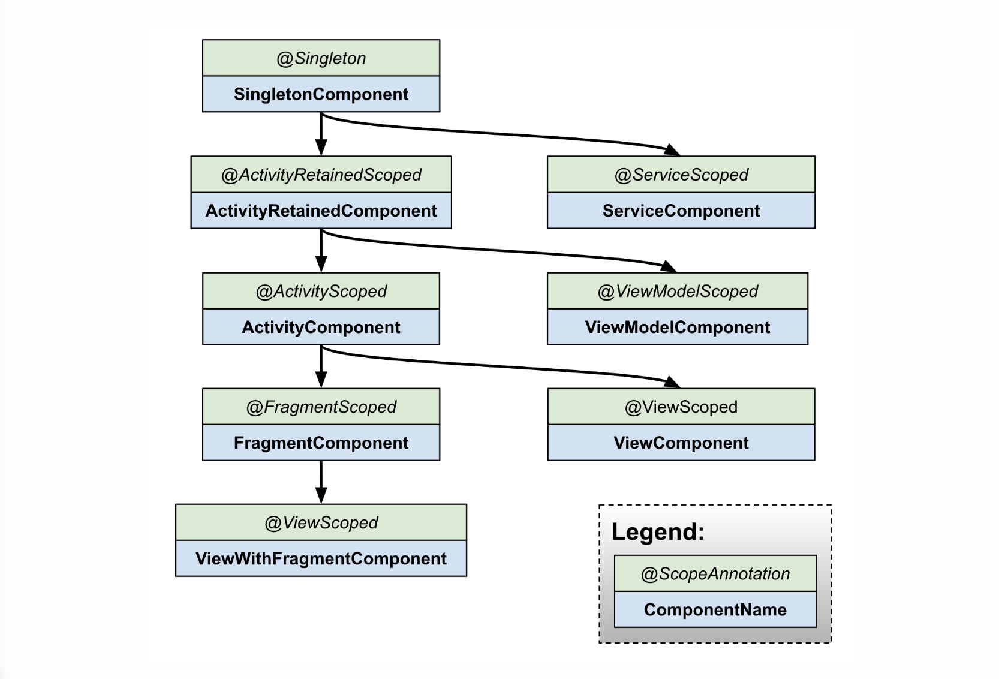
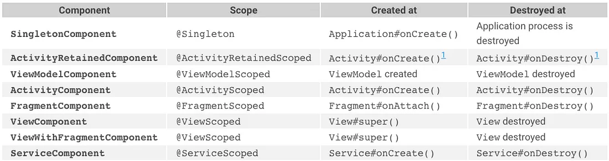
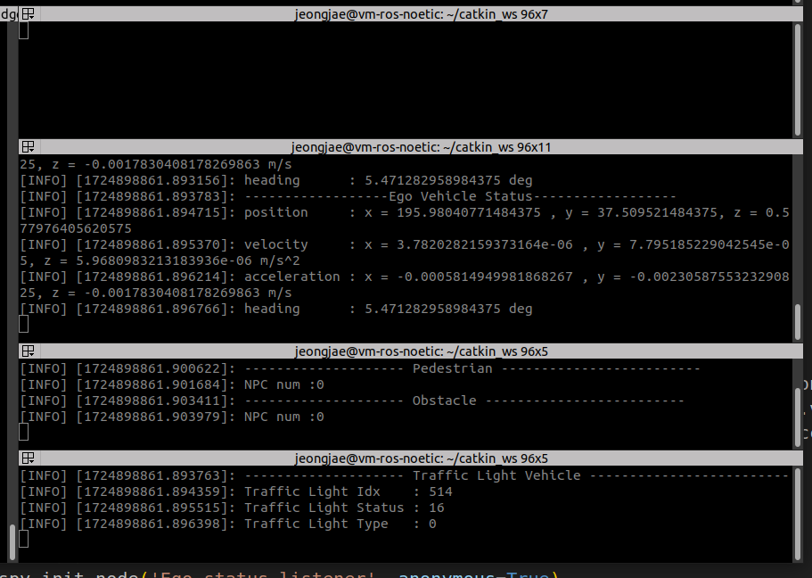
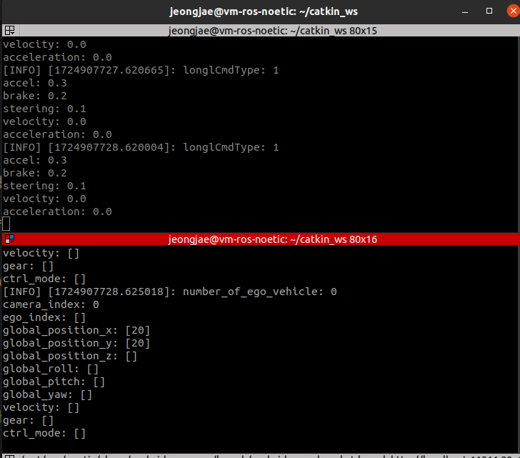

# 이현진 TIL

### Dependency Injection - 의존성 주입

#### 의존성

- 클래스 간의 의존 관계를 가지는 상황
- A클래스 내부에서 B클래스가 생성, 사용되는 경우

#### 의존성 주입

- 클래스 외부에서 객체를 생성 후 넣어주는 경우
- <b>일종의 디자인 패턴!</b>

```kotlin
class MainActivity : AppCompatActivity() {
   
    override fun onCreate(savedInstanceState: Bundle?) {
        super.onCreate(savedInstanceState)
        setContentView(R.layout.activity_main)
        
        val preson = Person("hyunjin")
    }
}

class Person(val name: String)

// Di가 없는 코드
// class Person{
// 		val name = "hyunjin"
// }
```

- Person 클래스는 name에 의존적

#### 장점

- 코드의 재사용성이 증가한다
- 테스트에 용이하다
- 클래스간 결합도가 낮아진다
- 코드 변경에 유연하고 자유롭다
- 보일러 플레이트 코드가 줄어든다
- 앱 생명주기에 따라 관리되어 적절한 시점에 필요한 객체들이 자동으로 주입된다

### Dagger Hilt

- 인스턴스를 클래스 외부에서 주입하기 위해서는 인스턴스에 대한 생명주기 관리가 필요
- Hilt는 이를 자동으로 관리해주는 안드로이드 전용 DI 라이브러리

#### **Hilt Component**

- Hilt에서 의미하는 컴포넌트는 module과 injection을 묶어주는 역할을 한다
    - 의존성 주입을 위한 컨테이너 역할을 한다
- 각 컴포넌트는 특정한 생명주기와 연결되어 있다
    - 생명주기 동안 사용할 수 있는 의존성 객체를 제공
- constructor injection의 경우 이에 맞게 컴포넌트를 생성
- module로 만들 경우 내가 선언한 스코프에 맞게 컴포넌트를 생성

#### **Hilt Scope**

- 의존성의 수명을 정의하는데 사용
- 특정 컴포넌트와 연결되어 있다
- 스코프를 사용하여 의존성이 특정 컴포넌트의 생명주기동안 유지되도록 할 수 있다
    - 의존성이 언제 생성되고 언제 파괴될지를 결정하는 것


<b>컴포넌트</b>는 의존성을 주입을 위한 컨테이너이자, 의존성 주입이 가능한 범위와 생명주기를 정의하는 구조<br>
<b>스코프</b>는 의존성의 생명주기 관리와 관련이 있고, 특정 컴포넌트에 의존성을 결합하여 사용


- Hilt 컴포넌트 계층



- 컴포넌트관련 scope, 생성 및 파괴시점



## **SubProject1**



