# D211

## 1주차 PJT

### 1. Publish 와 subscribe

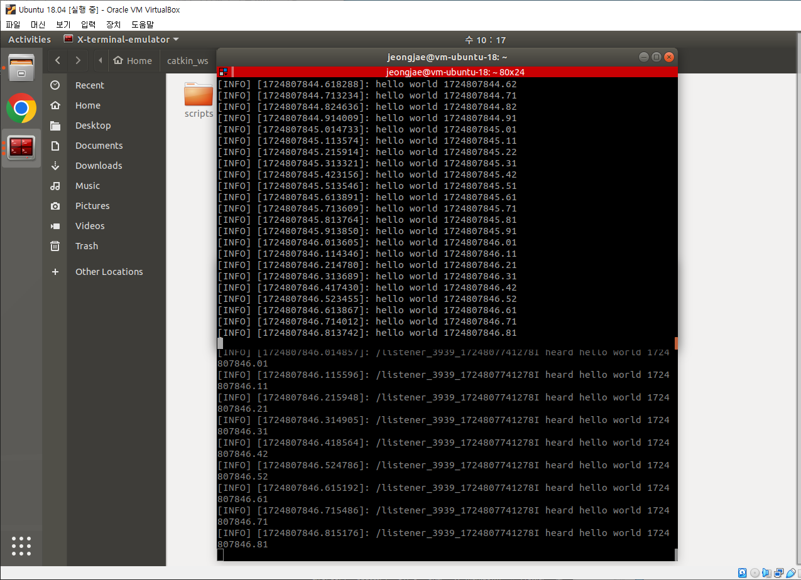

### 2. Launch

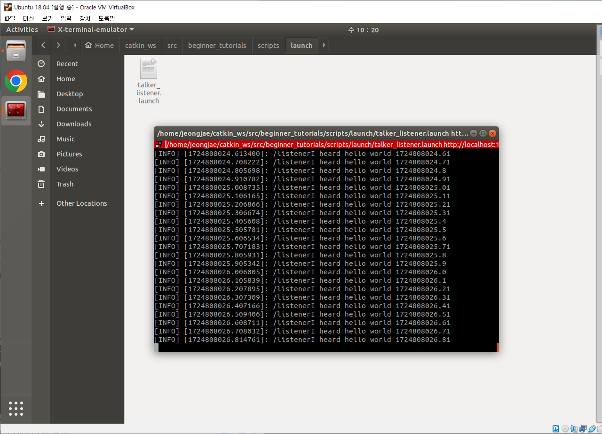

### 3. 메시지 publish 와 subscribe

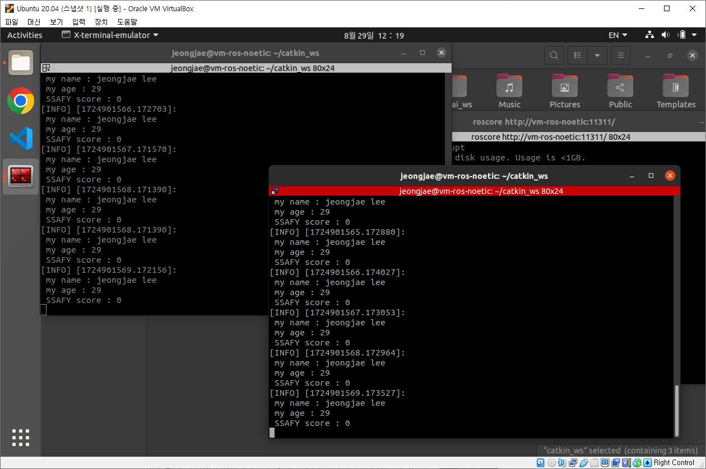

### 4. Custom launch

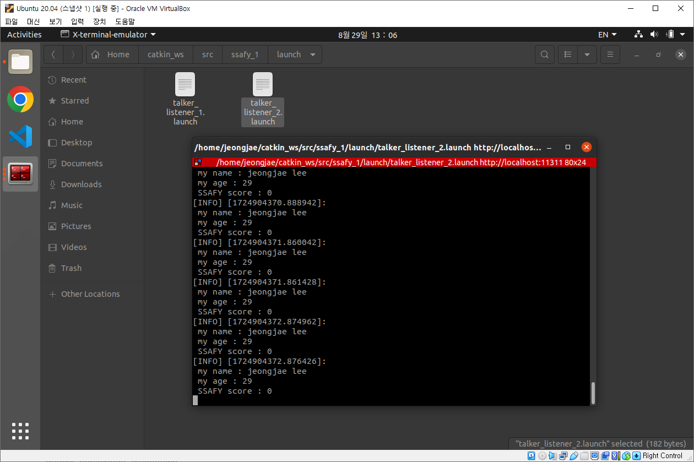

### 5. Service call

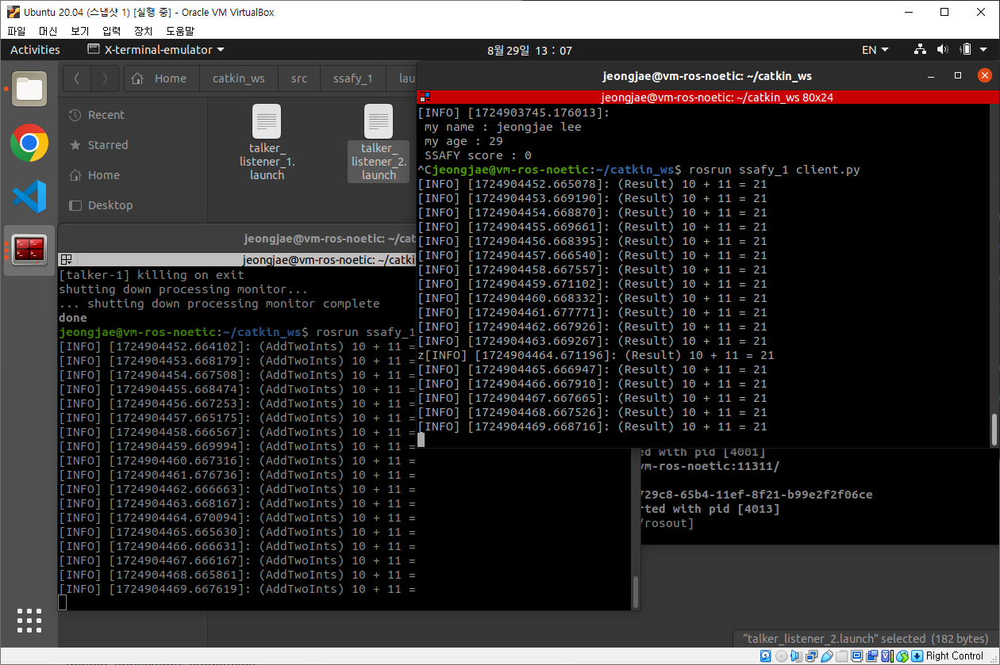

### 6. Morai 메세지 Subscribe-CollsionData

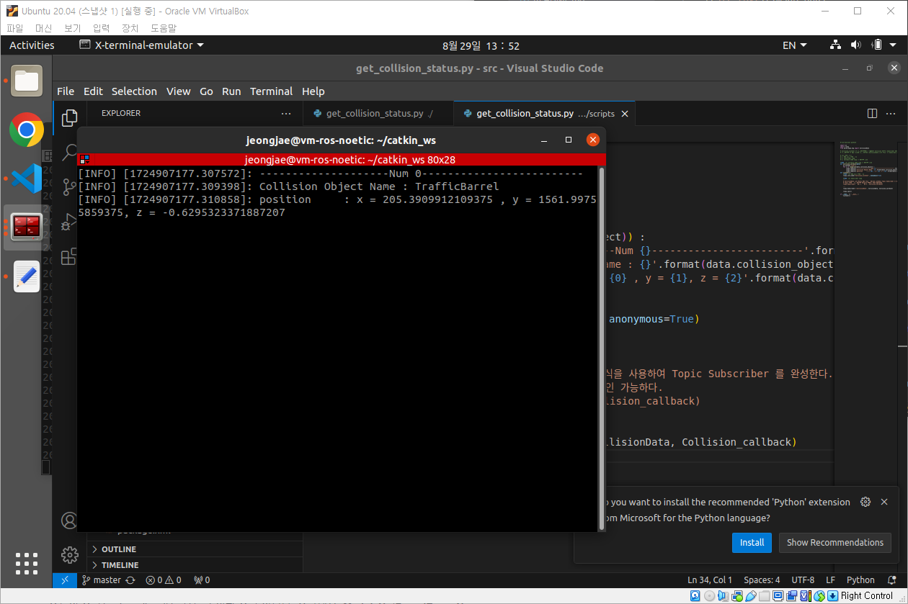

### 7. Morai 메세지 Subscribe-ObjectStatusList

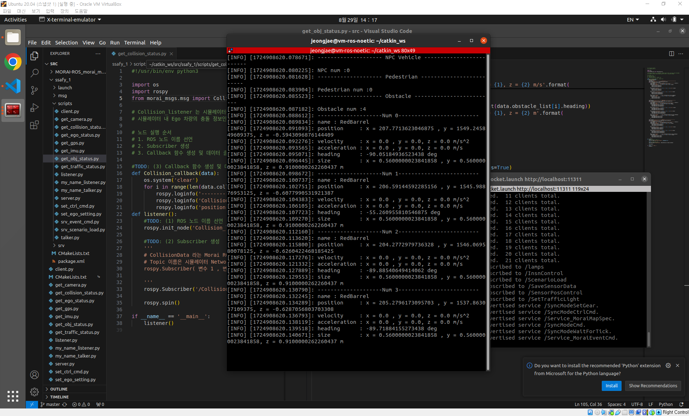

### 8. Morai 메세지 Subscribe-EgoVehicleStatus

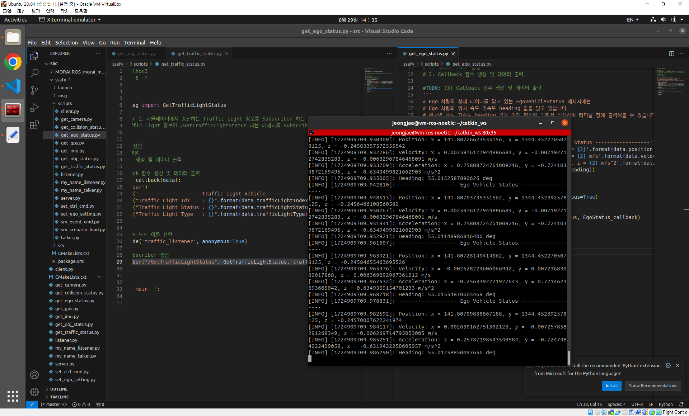

### 9. Morai 메세지 Subscribe-GetTrafficLightStatus

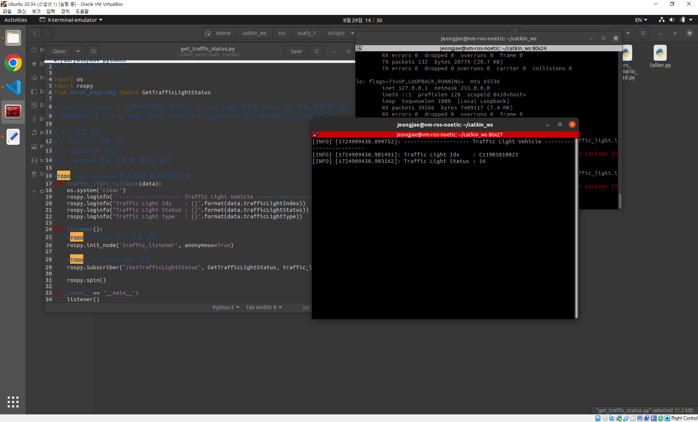

### 10. Morai 메세지 Publish-CtrlCmd

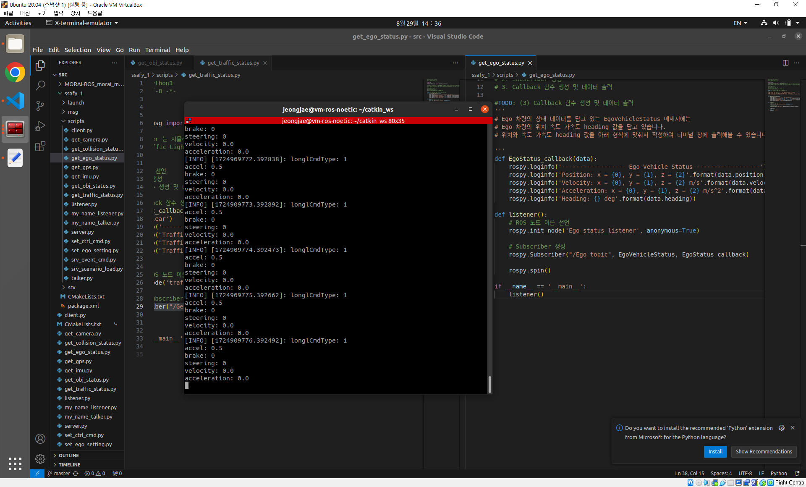

### 11. Morai 메세지 Service Call-Event infor, Lamp

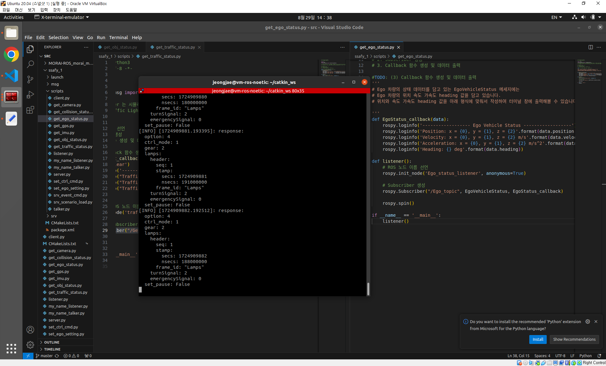

### 12. Morai 메세지 Service Call-ScenarioLoad

### 13. Sensor 메세지 Camera

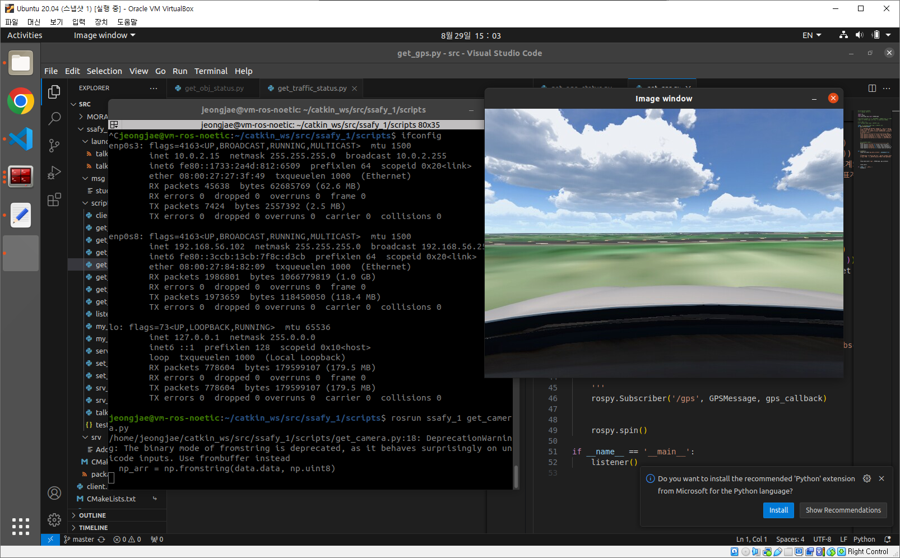

### 14. Sensor 메세지 GPS

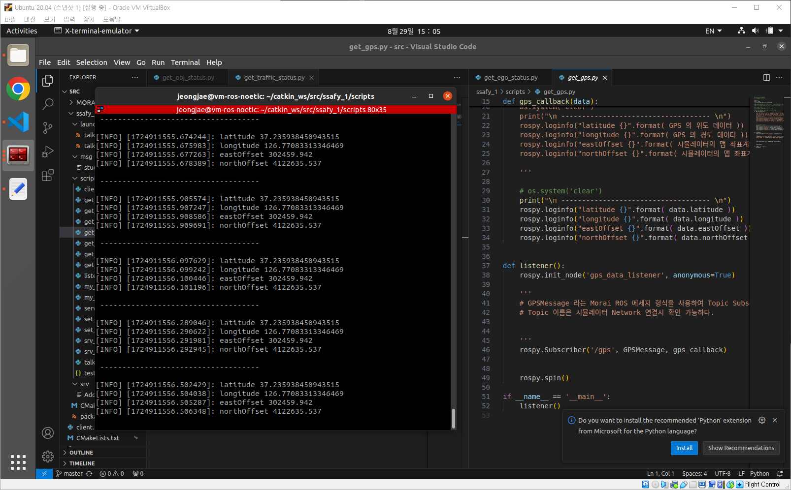

### 15. Sensor 메세지 GPS/IMU

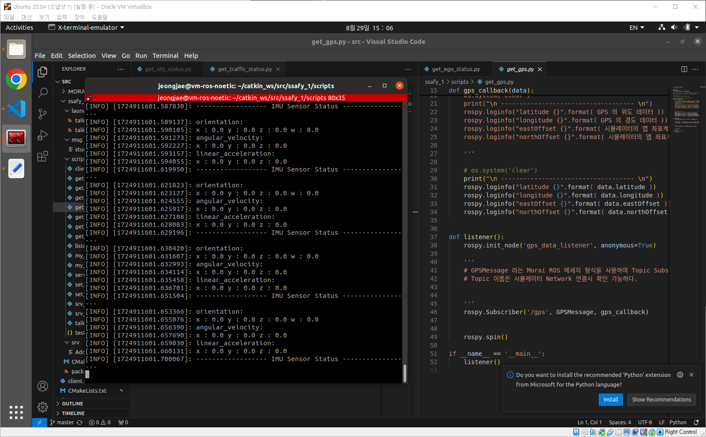
