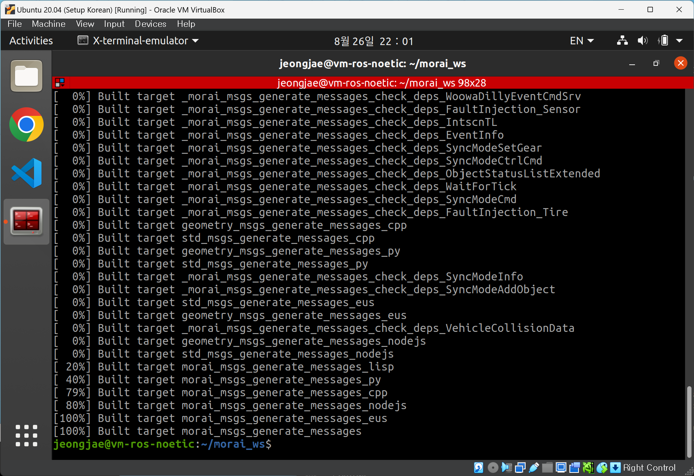
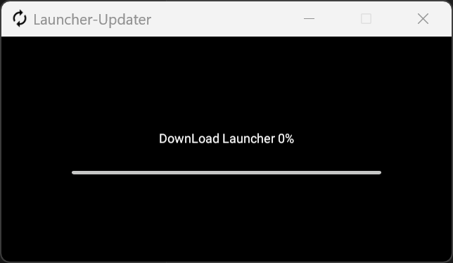

# 이정재

## TIL

### Day 1
1. Create VBox Instance(ROS Noetic in Ubuntu 20.04)

2. Fail to install ROS2 Foxy in Ubuntu 20.04

3. Complete to build `morai_msgs`

4. Fail to connect the Morai Simulator

### Day 2

### Day 3

### Day 4

### Day 5